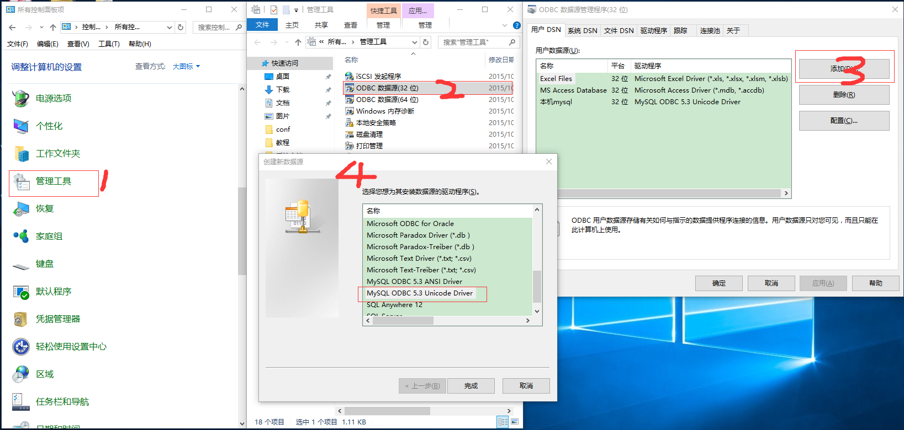
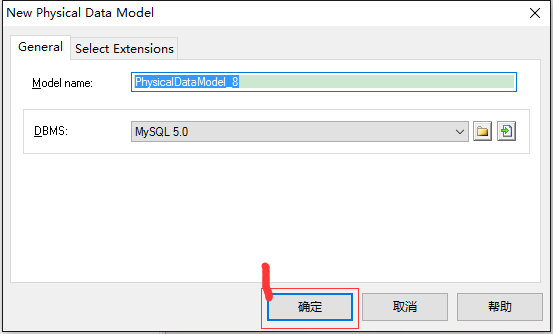
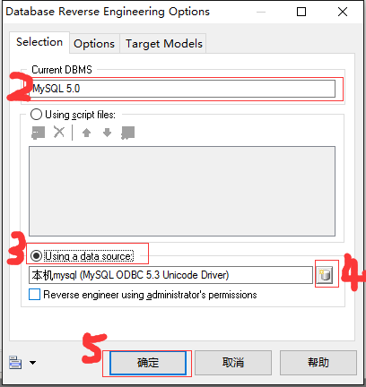
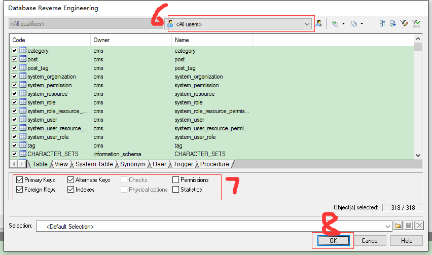
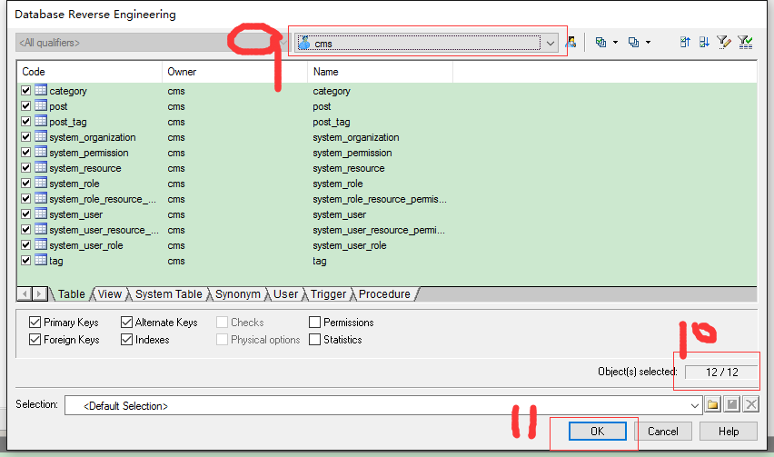

####PowerDesigner逆向工程之Database
1.安装MySQL Connector/ODBC x86（注意一定是x86,不然PowerDesigner不能使用）   
2.windows10中添加MySQL数据源，如下图

3.PowerDesigner逆向工程Mysql全过程  
PowerDesigner->File->Reverse Engineer->Database 弹出如下窗口

  
4.逆向工程的意义  
