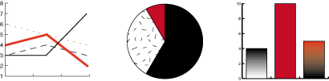

这系列介绍Java 2D API及如何在Java程序中显示和打印2D图形。本教程是为了提高开发人员的Java 2D API的知识的，同样适用电脑图形初学者。几乎每一个部分包含相关的例子来说明特定的功能。Java 2D API使您可以轻松地完成以下任务：  
- 绘制线条、矩形和其他几何形状  
- 形状填充，固体颜色、梯度和纹理。    
- 绘制文字，精细控制字体的选择和呈现的过程来    
- 画图，随意的应用过滤操作来  
- 应用合成和转化操作在任何上述渲染操作。  
这一章也解释了不熟悉的概念,例如合成。

使用2D图形API来展示复杂的图形  

使用图像滤镜操作  
本章描述了在屏幕上画图和屏幕图像的概念，以及表面和打印设备。本系列包含了大部分Java 2D API常用的操作和简短的描述了更高级的特性。
- [1.Java 2D API 概述](./1.Java 2D API 概述/README.md) 介绍Java 2D关键概念和描述Java 2D渲染模型。这课的概念比其他课的概念多，它使您能够得到深入基本概念和类描述。  
- [2.图形入门](./2.图形入门/README.md)通过开发示例向您展示如何获得一个图形对象和使用他来完成常见的图形渲染任务。  
- [3.使用几何学](./3.使用几何学/README.md)教你如何使用api来绘制基本图形和任意形状,以及如何应用花哨的笔画和填充样式。
- [4.使用文本API](./4.使用文本API/README.md)向您展示如何有效地使用文本api，包括如何创建一个字体对象所需的属性，测量文本，并确定系统上可用的字体的名字。  
- [5.使用图像](./5.使用图像/README.md)解释了如何创建一个BufferedImage对象,执行像滤波操作,并绘制在一个图像。   
- [6.打印](./6.打印/README.md)教你如何呈现2D图形打印机,打印复杂的文档,并使用打印服务。  
- [7.Java 2D高级话题](./7.Java 2D高级话题/README.md)解释如何执行转换、剪辑画地区、复合重叠图形,指定呈现偏好,和控制渲染质量。  

[参考](https://docs.oracle.com/javase/tutorial/2d/index.html)